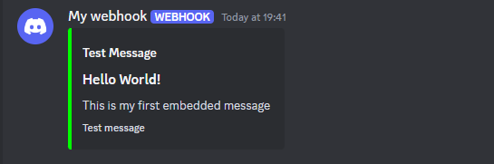
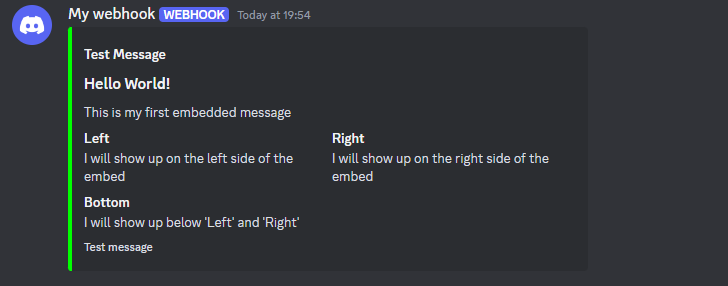

# Embeds

Sending messages with embeds is super simple. You can either do it with or without fields, This page covers both. Fields are a way to add "sections of information" into your embed, they can be lined next to each other or be in a list. Each one has a title and content.

Discord limits each message to have a maximum of 10 embeds per message before refusing to send the message. Don't worry, Discord Bridge will drop any extra embeds you add after the tenth although in the future it will split it into a second message which will make it look like all the embeds are from the same message.

## Without Fields

Assuming you are following on from [Creating Webhooks](../SettingUpWebhook.md) you can just add the `:withEmbed` function and fill out the params yourself. Otherwise here is more code you can copy and paste:
```lua
local EmbedMessage = DiscordBridge.Message.new():WithName("My webhook"):WithEmbed("Hello World!", "Test Message", "This is my first embedded message", "Test message", Color3.fromRGB(0, 255, 0))
```
Which results in a message like this:



## With Fields

Adding fields is super simple. First you will have to create a EmbedFields which describes all the fields in your embed, here is an example:  

```lua
local Fields = DiscordBridge.EmbedFields.new():AddField("Left", "I will show up on the left side of the embed", true):AddField("Right", "I will show up on the right side of the embed", true):AddField("Bottom", "I will show up below 'Left' and 'Right'", false)
```

Then simply pass that into your `:WithEmbed` call. Here is the previous example from above with the fields:

```lua
local Fields = DiscordBridge.EmbedFields.new():AddField("Left", "I will show up on the left side of the embed", true):AddField("Right", "I will show up on the right side of the embed", true):AddField("Bottom", "I will show up below 'Left' and 'Right'", false)

local EmbedMessage = DiscordBridge.Message.new():WithName("My webhook"):WithEmbed("Hello World!", "Test Message", "This is my first embedded message", "Test message", Color3.fromRGB(0, 255, 0), Fields)
```

Sending this message will result with a message like this:

