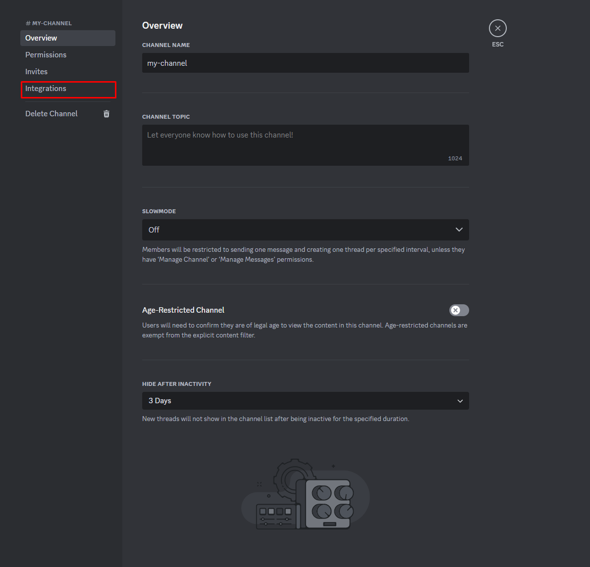
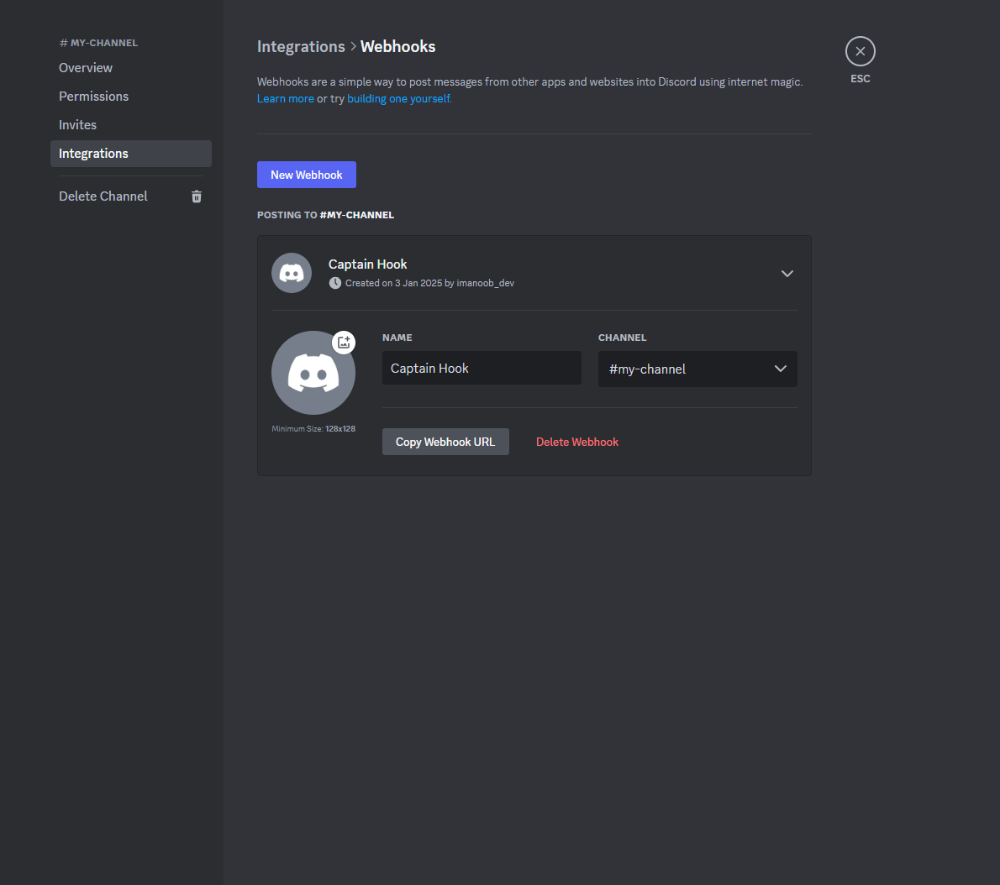
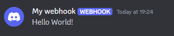

# Creating Webhooks

This page goes over how to create a discord webhook as well as sending your first message to your webhook.

## Creating a webhook

Webhooks are only available in server channels. For setup / testing it is recommended that you create a second private channel in your server for setting up this webhook. Later on we can easily switch over the webhook URL. Once you have an empty channel you can continue with the setup.

Right click on your channel and press "Edit Channel" alternately you can press the cog which appears when you hover over the channel name. Then find "Integrations" tab on the left:



Clicking this will go to a different screen where you can press create webhook which will then take you here:



All we care about here is clicking the "Copy Webhook URL" button. Since Discord Bridge can set the username and in the future the icon as well we don't need to change anything else here.

:::warning
Make sure you don't share this URL as they too will be able to send any messages they want through the webhook which we don't want.
:::

## Hello World

Now that we have a webhook setup lets send a "Hello World" message. In your game create a server script and add this code:
```lua
local DiscordBridge = require(Path.To.DiscordBridge)
local URL = "Your URL goes here" -- Make sure the URL goes between the speach marks

local Hook = DiscordBridge.Hook.new(URL)

local HelloWorldMessage = DiscordBridge.Message.new()
HelloWorldMessage:SetBotName("My webhook")
HelloWorldMessage:SetMessageContent("Hello World!")

local _, HelloWorldMessageJSON = HelloWorldMessage:GetJSON()
Hook:SendMessage(HelloWorldMessageJSON)
```
:::danger
This code will change soon when message function chaining is introduced!
:::

Pressing play your webhook should send a message like this:

